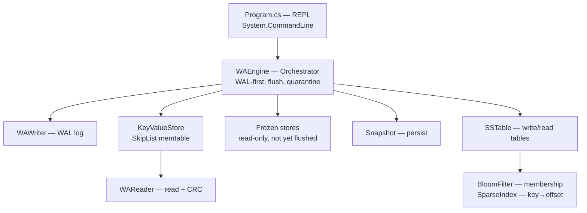

# KV Store — Design Document

## Overview

KV Store is an LSM-flavored key-value store. Acknowledged writes are appended to
a write-ahead log (WAL) before being applied to an in-memory store; on startup
the log is replayed to recover state. When the in-memory store crosses a size
threshold it is frozen and flushed to an immutable, sorted on-disk table
(SSTable). Snapshotting bounds WAL growth. Read path: newest in-memory store,
then frozen stores, then on-disk tables (newest first).

## Goals

- Survive crash/restart without losing acknowledged writes.
- Battery-friendly read performance: recent writes stay in memory; old writes
  live in SSTables searchable via bloom filter + sparse index.
- Simple, auditable on-disk formats with corruption detection.
- Minimal dependencies; a small, self-contained codebase.

## Non-Goals

- Multi-process or multi-threaded access.
- Distributed/replicated storage.
- Typed values / schema enforcement.
- Automatic recovery on interactive `snapshot load`.
- Automatic WAL compaction via SSTable (only snapshot truncates the WAL today).
- Networking, authentication, or external persistence beyond the
  WAL/snapshot/SSTable files.

> Values are opaque byte arrays on disk; the CLI offers a best-effort UTF-8 view
> (`get`) or a raw hex view (`gethex`), but the storage layer is schema-free.

## Configuration

- **`--data-dir <dir>` / `-d <dir>`** — data directory holding `wal_log` and
  `snapshot.dat`. Defaults to `./data`. Supplied once at startup, **before** any
  REPL command:

  ```
  $ dotnet run -- --data-dir /tmp/kv
  > put k v
  > get k
  ```

  The directory is created if missing. Both on-disk files are derived from it
  via `Path.Combine`; the value is read once and reused for the whole session —
  it is not a per-command option.

## Architecture



### Components

- **WAEngine** — enforces the WAL-first protocol: serialize record → append to
  log (`Flush(true)`) → apply to memory. Wraps writer, store, reader, snapshot.
  Freezes the memtable and flushes it to an SSTable when its byte footprint
  crosses `flushThresholdBytes`; on startup catalogs `SSTable-<5 digits>` files
  (newest first) and quarantines corrupted ones.
- **WAWriter** — appends CRC-protected records to `wal_log`; truncates it after
  a snapshot.
- **WAReader** — reads records sequentially, validating CRC32, stopping at the
  first corrupt/truncated entry.
- **KeyValueStore** — in-memory skip list backed memtable with byte-footprint
  accounting; `MakeImmutable` turns it read-only so a flush can freeze it
  in place while a new mutable store takes over.
- **Snapshot** — serializes the full store to `snapshot.dat`; loads it back
  into a temp dictionary and swaps on success (so a bad snapshot cannot
  destroy live data).
- **SSTable** — writes memtable contents to a sorted, immutable table with a
  header magic, `SparseIndex` (every 10th record + byte offset), `BloomFilter`
  bytes, first/last keys, and a fixed-size footer. Reading opens the file,
  verifies header + footer magic, then resolves a key via bloom filter → sparse
  index → forward scan.
- **BloomFilter / SparseIndex** — on-disk acceleration structures loaded into
  memory once per table; `ImmutableBloomFilter` + `SkipList<string, long>`
  answer membership and key→offset lookups without opening the records.

## Data Flow

- **put(key, value):** build record → append to WAL (flush to disk) → on
  success, update in-memory store.
- **delete(key):** append DELETE record to WAL → remove from store.
- **get / gethex(key):** newest in-memory store → frozen stores (newest first)
  → on-disk tables (newest first).
- **flush:** when the store's byte footprint exceeds the threshold, freeze the
  current store (`MakeImmutable`), swap in a fresh one, then write the frozen
  store to `SSTable-<SerialNumber:D5>` and register the resulting immutable
  table in memory.
- **startup:** resolve `<data-dir>/snapshot.dat`, `<data-dir>/wal_log`, and
  `SSTable-*`; load snapshot, replay log, then read tables newest-first.
- **snapshot save:** serialize store → truncate WAL (all state now in the
  snapshot).
- **replay:** re-apply WAL records into the store on demand.

## On-Disk WAL Format

Each record is written to `<data-dir>/wal_log` as a CRC followed by a
length-prefixed body:

```
[4: CRC32 of body]
[4: RecordLength = length of body]
[body]:
    [1: Op]                      0x00 = PUT, 0x01 = DELETE
    [7-bit length, then UTF-8]   Key
    [4: ValueLength]             (PUT only)
    [N:  Value]                  (PUT only; empty for DELETE)
```

- CRC32 covers the **body only** (Op, Key, Value), not the length field.
- Key is written with .NET's `BinaryWriter` 7-bit-length-prefix encoding.
- `RecordLength` is the total body byte count (Op + prefixed key + value).
- A shorter-than-declared read or a CRC mismatch marks the entry
  `CorruptedEntry`; replay stops at that record.

### Example encode

`put name "hi"` produces body `00 04 6e616d65 02000000 6869`:

```
00 | 04 6e616d65 | 02 00 00 00 | 68 69
op   key="name"   vlen=2        value="hi"
```

## Snapshot Format

Written with `BinaryWriter` to `<data-dir>/snapshot.dat`. Reuses the
CRC-protected `KVPairIO` pair format (see below):

```
[Int32: entry count]
for each entry:
    [KVPairIO pair: CRC + key + value]
```

A zero-length snapshot file is `FileIsEmpty`; a duplicate key or any bad pair is
`CorruptedEntry`.

## On-Disk Pair Format (KVPairIO)

The record format shared by snapshots and SSTables. Each pair is CRC-protected:

```
[4: CRC32 of payload]
[7-bit key length, then key bytes]
[4: ValueLength (little-endian)]
[N: Value]
```

- CRC32 covers `key + ValueLength + Value` (not the 7-bit length prefix).
- Reader re-derives the CRC incrementally over the same bytes and rejects on
  mismatch with `CorruptedEntry`.

## SSTable Format

A single sorted, immutable table written to `SSTable-<SerialNumber:D5>`
(`SerialNumber` starts past the highest existing table):

```
[magic/version: 4B]                       "SST" + 0x01
[record blocks: KVPairIO pairs]           sorted by key
[sparse index: Key | Offset(8B)]          one entry per 10 records
[BloomFilter bytes]
[First key][Last key]
[Footer, fixed 52 bytes, written last]:
    [IndexOffset: 8B] [IndexLength: 4B]
    [FilterOffset: 8B] [FilterLength: 4B]
    [BitSize: 8B] [HashCount: 4B]
    [First/Last Key Offset: 8B]
    [RecordCount: 4B]
    [Magic/Version: 4B]                   repeated tail magic
```

- Writing streams records sequentially, indexing every 10th record
  (`i % 10 == 0`) as `key → byte offset`, and records `FirstKey`/`LastKey`.
- Reading validates header and tail magic, then uses the footer to locate and
  load the sparse index, bloom filter, and first/last keys into an
  `ImmutableSSTable`.
- Lookup (`TryReadEntry`): reject keys outside `[FirstKey, LastKey]`; consult the
  bloom filter; find the greatest index offset `≤ key`; open the file and scan
  records forward from that offset until the key is found or passed.
- The leftmost table in the catalog set is written first as `SSTable-TMP`
  then atomically `File.Move`d to its final name, so a crash mid-write leaves
  no partial `SSTable-#####`.

## Error Handling

All components return a `kv_store.Enums.ErrorCode` instead of throwing for
expected conditions. A `[Description]` on each enum value supplies a
human-readable message via `ErrorCode.GetDescription()`.

Distinct codes: `KeyNotValid` (bad input), `KeyNotFound` (get/delete miss),
`EntryIsEmpty`, `FileIsEmpty` (empty log/snapshot), `CorruptedEntry`
(bad/truncated WAL, snapshot, or table), `FileCorruptedOrUnsupportedVersion`
(failed startup magic check), `ErrorInSSTablesLoading` (aggregate: at least one
table failed to load), `WriteToImmutableInstance` (write to frozen store),
`IOError`/`AccessDenied` (file system), `InvalidPath`, `UnInitializedInstance`
(used before `Init`), `UnexpectedError` (catch-all).

### Table-load policy

`WAEngine.Init` catalogs every `SSTable-<5 digits>` file. Non-`None` loads are
recorded in the `out errors` list. `FileCorruptedOrUnsupportedVersion` and
`IOError` are quarantine-able: the file is renamed `*.corrupt` and loading
continues. Any other error aborts `Init` immediately and leaves the file in
place. Overall result is `ErrorInSSTablesLoading` (plus the error list) when at
least one table failed, `None` otherwise.

Known weakness: a corrupt WAL halts recovery at the first bad record; there is
no partial-recovery or record-skipping strategy.

## Key Decisions & Trade-offs

- **WAL-first (log then memory).** Disk is the source of truth for recovery;
  memory is a cache/index. Cost: every write is a synchronous disk flush.
- **`Flush(true)` per write.** Durability is guaranteed but write throughput
  is limited by disk latency. A batched/async flush would trade durability for
  speed — deferred.
- **CRC over body, not length (WAL).** Detects value/key corruption while
  keeping the length field outside the hash (simpler reader sizing). Trade-off:
  a corrupt length is caught by the bounds check, not the CRC.
- **Sparse index (every 10th record).** Keeps the index ~10% of record count;
  lookups scan forward from the nearest index entry. A denser index trades
  startup/file size for fewer record reads.
- **Bloom filter before index.** Rejects most absent keys with O(1) hashes and
  no file I/O; costs a few bits per key and a false-positive rate.
- **Freeze-then-flush.** The current store is made immutable before the new one
  accepts writes, so the memtable content is stable while it streams to disk.
- **Quarantine on load.** A bad table becomes `*.corrupt` (preserved for
  inspection) instead of silently dropped or crashing the process.
- **Snapshot via temp dict + swap.** Prevents a bad snapshot from clobbering
  live state (load only applies on full read success).
- **Snapshot truncates WAL.** Bounds log growth at the cost of a full rewrite
  of the dataset.
- **Shared object-code pair (KVPairIO).** Snapshots and SSTables reuse one
  CRC-protected pair format — one codec to audit, uniform corruption checks.

## Testing Strategy

Automated tests live in `tests/KvStore.Tests` (xUnit, no external test
framework beyond the runner). Coverage:

1. `SkipList` — insert/lookup/remove/scan ordering, duplicates, null keys.
2. `BloomFilter` — membership, false-positive rate, raw-byte round-down.
3. `WARecord` — record encode/decode, `Frame`/`Unframe` CRC validation,
   `KVPairIO` pair round-trips.
4. `WAWriter`/`WAReader` — append, replay, truncate, empty log, CRC tamper.
5. `Snapshot` — save/load round-trip, empty file, duplicate key, over-long
   pair → `CorruptedEntry`.
6. `SparseIndex` — add, write/read round-trip, truncated stream.
7. `SSTable` — full write→read round-trip, sparse offsets point at record
   starts, empty/`EntryIsEmpty`, bad header/tail magic, truncated file.
8. `WAEngine` — put/get/delete, replay, snapshot save/load + WAL truncation,
   non-stride key lookup through a flushed table, corrupt-table quarantine and
   `*.corrupt` rename, abort on non-quarantinable corruption, good+bad table
   mix, uninitialized ops, auto-flush persist across restart.

Run with:

```bash
dotnet test tests/KvStore.Tests/KvStore.Tests.csproj
```

## Open Questions / Future Work

- WAL compaction via SSTable (delete old WAL entries covered by a table).
- Batched/async WAL flushing for throughput.
- Partial recovery (skip corrupt records) vs. stop-at-first-corrupt.
- Dense-vs-sparse index tuning (stride is fixed at 10; no per-file setting).
- Multi-table compaction / tombstones (deletes currently only drop the key from
  memory; a frozen table can still serve a deleted key after restart).
