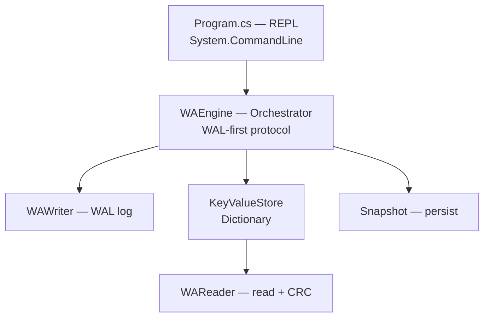

# KV Store — Design Document

## Overview

KV Store is a crash-recoverable in-memory key-value store. It guarantees that
acknowledged writes survive process death by persisting them to a write-ahead
log before applying them to memory, and by replaying that log on startup.
Snapshotting bounds log growth.

## Goals

- Survive crash/restart without losing acknowledged writes.
- Simple, auditable on-disk format with corruption detection.
- Minimal dependencies; a small, self-contained codebase.

## Non-Goals

- Multi-process or multi-threaded access.
- Distributed/replicated storage.
- Typed values / schema enforcement.
- Automatic recovery on interactive `snapshot load`.
- Networking, authentication, or external persistence beyond the WAL/snapshot files.

> Values are opaque byte arrays on disk; the CLI offers a best-effort UTF-8 view
> (`get`) or a raw hex view (`gethex`), but the storage layer is schema-free.

## Configuration

- **`--data-dir <dir>` / `-d <dir>`** — data directory holding `wal_log` and
  `snapshot.dat`. Defaults to `./data`. Supplied once at startup, **before** any
  REPL command:

  ```
  $ dotnet run -- --data-dir /tmp/kv
  > put k v
  > get k
  ```

  The directory is created if missing. Both on-disk files are derived from it
  via `Path.Combine`; the value is read once and reused for the whole session —
  it is not a per-command option.

## Architecture



### Components

- **WAEngine** — enforces the WAL-first protocol: serialize record → append to
  log (`Flush(true)`) → apply to memory. Wraps writer, store, reader, snapshot.
- **WAWriter** — appends CRC-protected records to `wal_log`; truncates it after
  a snapshot.
- **WAReader** — reads records sequentially, validating CRC32, stopping at the
  first corrupt/truncated entry.
- **KeyValueStore** — in-memory `Dictionary<string, byte[]>` with a
  bulk-initialize path for snapshot load.
- **Snapshot** — serializes the full store to `snapshot.dat`; loads it back
  into a temp dictionary and swaps on success (so a bad snapshot cannot
  destroy live data).

## Data Flow

- **put(key, value):** build record → append to WAL (flush to disk) → on
  success, update in-memory dict.
- **delete(key):** append DELETE record to WAL → remove from dict.
- **get / gethex(key):** read in-memory dict only (the log is never consulted on
  the read path).
- **startup:** resolve `<data-dir>/snapshot.dat` and `<data-dir>/wal_log`; if the
  snapshot exists, load it; if the log exists, replay its records into the store
  (snapshot first, log on top).
- **snapshot save:** serialize store → truncate WAL (all state now in the
  snapshot).
- **replay:** re-apply WAL records into the store on demand.

## On-Disk WAL Format

Each record is written to `<data-dir>/wal_log` as a CRC followed by a
length-prefixed body:

```
[4: CRC32 of body]
[4: RecordLength = length of body]
[body]:
    [1: Op]                      0x00 = PUT, 0x01 = DELETE
    [7-bit length, then UTF-8]   Key
    [4: ValueLength]             (PUT only)
    [N:  Value]                  (PUT only; empty for DELETE)
```

- CRC32 covers the **body only** (Op, Key, Value), not the length field.
- Key is written with .NET's `BinaryWriter` 7-bit-length-prefix encoding.
- `RecordLength` is the total body byte count (Op + prefixed key + value).
- A shorter-than-declared read or a CRC mismatch marks the entry
  `CorruptedEntry`; replay stops at that record.

### Example encode

`put name "hi"` produces body `00 04 6e616d65 02000000 6869`:

```
00 | 04 6e616d65 | 02 00 00 00 | 68 69
op   key="name"   vlen=2        value="hi"
```

## Snapshot Format

Written with `BinaryWriter` to `<data-dir>/snapshot.dat`:

```
[Int32: entry count]
for each entry:
    [7-bit length + UTF-8: Key]
    [Int32: ValueLength]
    [Value bytes]
```

## Error Handling

All components return a `kv_store.Enums.ErrorCode` instead of throwing for
expected conditions. A `[Description]` on each enum value supplies a
human-readable message via `ErrorCode.GetDescription()`.

Distinct codes: `KeyNotValid` (bad input), `KeyNotFound` (get/delete miss),
`CorruptedEntry` (bad/truncated WAL or snapshot), `IOError`/`AccessDenied`
(file system), `UnInitializedInstance` (used before `Initialize`),
`UnexpectedError` (catch-all).

Known weakness: a corrupt WAL halts recovery at the first bad record; there is
no partial-recovery or record-skipping strategy.

## Key Decisions & Trade-offs

- **WAL-first (log then memory).** Disk is the source of truth for recovery;
  memory is a cache/index. Cost: every write is a synchronous disk flush.
- **`Flush(true)` per write.** Durability is guaranteed but write throughput
  is limited by disk latency. A batched/async flush would trade durability for
  speed — deferred.
- **CRC over body, not length.** Detects value/key corruption while keeping the
  length field outside the hash (simpler reader sizing). Trade-off: a corrupt
  length is caught by the bounds check, not the CRC.
- **Snapshot via temp dict + swap.** Prevents a bad snapshot from clobbering
  live state (load only applies on full read success).
- **Snapshot truncates WAL.** Bounds log growth at the cost of a full rewrite
  of the dataset.
- **No length field inside `WARecord.GetInBytes`.** The on-disk length is
  written once in `GetInBytesWithHash` from `bytes.Length`; the `_RecordLength`
  struct field is dead accounting and removable.

## Testing Strategy

No automated test project exists; correctness was verified manually through
the REPL and by inspecting the on-disk bytes. Recommended first automated
tests (in priority order):

1. Round-trip: put → restart → get reproduces values.
2. WAL append then snapshot; verify WAL truncation and full recovery.
3. Corrupt a record mid-file; verify `CorruptedEntry` and clean stop.
4. Empty-value PUT survives replay.
5. DELETE followed by PUT of the same key recovers correctly.

## Open Questions / Future Work

- Automated test harness (xUnit / NUnit).
- Batched/async WAL flushing for throughput.
- Partial recovery (skip corrupt records) vs. stop-at-first-corrupt.
