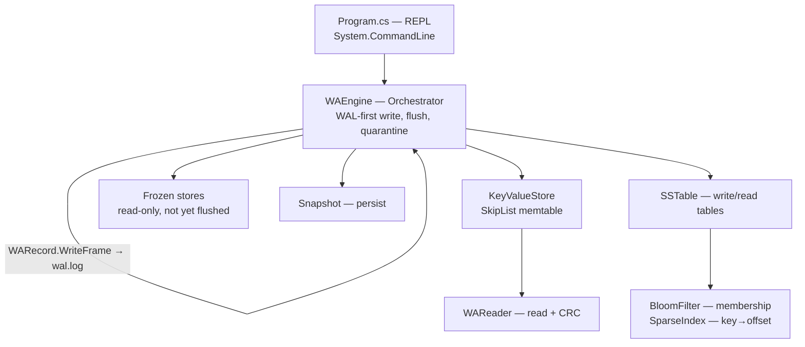

# KV Store — Design Document

## Overview

KV Store is an LSM-flavored key-value store. Acknowledged writes are appended to
a write-ahead log (WAL) before being applied to an in-memory store; on startup
the log is replayed to recover state. When the in-memory store crosses a size
threshold it is frozen and flushed to an immutable, sorted on-disk table
(SSTable). Snapshotting bounds WAL growth. Read path: newest in-memory store,
then frozen stores, then on-disk tables (newest first).

## Goals

- Survive crash/restart without losing acknowledged writes.
- Battery-friendly read performance: recent writes stay in memory; old writes
  live in SSTables searchable via bloom filter + sparse index.
- Simple, auditable on-disk formats with corruption detection.
- Minimal dependencies; a small, self-contained codebase.

## Non-Goals

- Multi-process or multi-threaded access.
- Distributed/replicated storage.
- Typed values / schema enforcement.
- Automatic recovery on interactive `snapshot load`.
- Automatic WAL compaction via SSTable (only snapshot truncates the WAL today).
- Networking, authentication, or external persistence beyond the
  WAL/snapshot/SSTable files.

> Values are opaque byte arrays on disk; the CLI offers a best-effort UTF-8 view
> (`get`) or a raw hex view (`get -x`), but the storage layer is schema-free.

## Configuration

- **`--data-dir <dir>` / `-d <dir>`** — data directory holding `wal.log` and
  `snapshot.dat`. Defaults to `./data`. Supplied once at startup, **before** any
  REPL command:

  ```
  $ dotnet run -- --data-dir /tmp/kv
  > put k v
  > get k
  ```

  The directory is created if missing. Both on-disk files are derived from it
  via `Path.Combine`; the value is read once and reused for the whole session —
  it is not a per-command option.

## Architecture



### Components

- **WAEngine** — enforces the WAL-first protocol: serialize a CRC-protected
  record (`WARecord.WriteFrame`) → append to `wal.log` → apply to memory. Wires
  together the store, WAL, reader, snapshot, and SSTables. Freezes the memtable
  and flushes it to an SSTable when its byte footprint crosses
  `flushThresholdBytes`; on startup loads the snapshot, replays the WAL on top,
  then catalogs `SSTable-<5 digits>` files (newest first) and quarantines
  corrupted ones. `Scan` merges the memtable, frozen stores, and tables into one
  sorted, newest-first, first-seen-wins view over an inclusive
  `[startKey, endKey]` range (see Data Flow).
- **WARecord** — single frame codec shared by the WAL, snapshots, and SSTables:
  `[CRC:4][op:1][7-bit key][vlen:4+value, PUT only]`. A delete is a frame with no
  value payload; `ReadFromBytes` yields `value = null` for DELETEs.
- **WAReader** — reads records sequentially, validating CRC32, stopping at the
  first corrupt/truncated entry.
- **KeyValueStore** — in-memory skip list backed memtable with byte-footprint
  accounting; `MakeImmutable` turns it read-only so a flush can freeze it in
  place while a new mutable store takes over. A tombstone is a `null` value;
  `TryGet` returns `KeyDeleted` for tombstones.
- **Snapshot** — serializes the full store to `snapshot.dat`; loads it back
  into a temp dictionary and swaps on success (so a bad snapshot cannot destroy
  live data).
- **SSTable** — writes memtable contents to a sorted, immutable table with a
  header magic, `SparseIndex` (every 10th record + byte offset), `BloomFilter`
  bytes, first/last keys, and a fixed-size footer. Reading opens the file,
  verifies header + footer magic, then resolves a key via bloom filter → sparse
  index → forward scan.
- **BloomFilter / SparseIndex** — on-disk acceleration structures loaded into
  memory once per table; `ImmutableBloomFilter` + `SkipList<string, long>`
  answer membership and key→offset lookups without opening the records.

## Data Flow

- **put(key, value):** build record → append to WAL (`WARecord.WriteFrame`,
  synchronous) → on success, update in-memory store.
- **delete(key):** append DELETE record to WAL (no value payload) → write a
  tombstone (`KVList[key] = null`). Idempotent: returns `None` even for absent
  keys, and the tombstone node keeps the key in memory.
- **get(key):** newest in-memory store → frozen stores (newest first)
  → on-disk tables (newest first). A tombstone hit is terminal: it reports
  `KeyNotFound` (engine normalizes `KeyDeleted`) and does **not** fall through
  to older sources, so a delete always shadows older data.
- **scan(startKey, endKey):** fold newest-first sources (memtable → frozen →
  tables) into a `SkipList` with insert-if-absent semantics, so on a key
  collision the **newest** source wins and a tombstone inserts as `null`,
  occupying its slot; then filter nulls and return the `SkipList` — already
  sorted by key, inclusive `[startKey, endKey]`, tombstones never resurrect
  older data, and no re-sort is needed.
- **flush:** when the store's byte footprint exceeds the threshold, freeze the
  current store (`MakeImmutable`), swap in a fresh one, then write the frozen
  store to `SSTable-<SerialNumber:D5>` (highest existing + 1) and register the
  resulting immutable table at the **front** of the in-memory catalog
  (`Insert(0, ...)`) so in-session reads stay newest-first.
- **compact:** when `immutableSSTables.Count > CompactThreshold` (4) after a
  flush, flatten the whole catalog newest-first into a single table (reusing
  the oldest serial), prune all tombstones, then delete the sources — see
  Compaction below.
- **startup:** `Init` ensures the data dir and empty `wal.log`/`snapshot.dat`
  exist, loads the snapshot into the memstore, replays the WAL on top (newest
  state in memory first), and only **then** catalogs `SSTable-*` files
  newest-first (renaming quarantine-able bad ones `*.corrupt`). WAL replayed
  first keeps the newest writes in the memtable; tables hold progressively older
  data, which the newest-first read path already honors.
- **snapshot save:** serialize store → truncate WAL (all state now in the
  snapshot).
- **replay:** re-apply WAL records into the store on demand.

## On-Disk WAL Format

Each record is written to `<data-dir>/wal.log` as a CRC followed by a
length-prefixed body:

```
[4: CRC32 of payload]
[1: Op]                      0x00 = PUT, 0x01 = DELETE
[7-bit length, then UTF-8]   Key
[4: ValueLength]             (PUT only)
[N:  Value]                  (PUT only; absent for DELETE)
```

- CRC32 covers the payload bytes only (Op, Key, Value).
- Key is written with .NET's `BinaryWriter` 7-bit-length-prefix encoding.
- There is **no record-length field**: the reader consumes one frame per
  `ReadFrame` call and stops at the first end-of-stream or CRC mismatch
  (`CorruptedEntry`).
- DELETE frames omit `ValueLength` and `Value` entirely; reading one yields
  `value = null`.

### Example encode

`put name "hi"` produces body `00 04 6e616d65 02000000 6869`:

```
00 | 04 6e616d65  | 02 00 00 00 | 68 69
op   key="name"    vlen=2        value="hi"
```

`delete name` produces body `01 04 6e616d65`:

```
01 | 04 6e616d65
op   key="name"
```

## Snapshot Format

Written with `BinaryWriter` to `<data-dir>/snapshot.dat`. Reuses the
CRC-protected `WARecord` frame format. Tombstones serialize as DELETE frames
and load back as `null` values, preserving deleted keys across
save/load.

```
[Int32: entry count]
for each entry:
    [WARecord frame: CRC + op + 7-bit key (+ vlen + value for PUT)]
```

A zero-length snapshot file is `FileIsEmpty`; a duplicate key or any bad frame
is `CorruptedEntry`.

## On-Disk Pair Format

The record format shared by the WAL, snapshots, and SSTables is the `WARecord`
frame described above (`[CRC][op][7-bit key][vlen+value, PUT only]`). A single
codec with one corruption check serves all three file kinds.

## SSTable Format

A single sorted, immutable table written to `SSTable-<SerialNumber:D5>`
(`SerialNumber` starts past the highest existing table):

```
[magic/version: 4B]                       "SST" + 0x01
[record blocks: WARecord frames]          sorted by key; tombstones as DELETE frames
[sparse index: Key | Offset(8B)]          one entry per 10 records
[BloomFilter bytes]
[First key][Last key]
[Footer, fixed 52 bytes, written last]:
    [IndexOffset: 8B] [IndexLength: 4B]
    [FilterOffset: 8B] [FilterLength: 4B]
    [BitSize: 8B] [HashCount: 4B]
    [First/Last Key Offset: 8B]
    [RecordCount: 4B]
    [Magic/Version: 4B]                   repeated tail magic
```

- Writing streams records sequentially, indexing every 10th record
  (`i % 10 == 0`) as `key → byte offset`, and records `FirstKey`/`LastKey`.
  Tombstoned entries (null in the memtable) are written as DELETE frames.
- Reading validates header and tail magic, then uses the footer to locate and
  load the sparse index, bloom filter, and first/last keys into an
  `ImmutableSSTable`.
- Lookup (`TryReadEntry`): reject keys outside `[FirstKey, LastKey]`; consult the
  bloom filter; find the greatest index offset `≤ key`; open the file and scan
  records forward from that offset until the key is found or passed. A DELETE
  frame returns `KeyDeleted` (the engine normalizes it to `KeyNotFound`).
- Scan mirrors lookup: seek the sparse index at the greatest offset `≤
  startKey` (clamped to skip the 4-byte header), then read frames forward,
  dropping records `< startKey`, until `endKey` is passed (inclusive) or the
  read position passes the index area. Tombstones surface as DELETE frames and
  the engine filters them after the merge.
- The leftmost table in the catalog set is written first as `SSTable-TMP`
  then atomically `File.Move`d to its final name, so a crash mid-write leaves
  no partial `SSTable-#####`.

## Compaction

Triggered automatically at the end of every flush when the table count exceeds
`CompactThreshold` (`> 4`): the whole catalog is folded back into a single
table.

- **Flatten, not tiers.** All tables merge newest-first into one in a single
  pass — deliberately no leveled/tiered structure. One rule, no level sizing,
  no tombstone bookkeeping. Trade-off: every compaction rewrites the entire
  history (see upgrade path below).
- **Merge kernel = the range-scan fold.** Each table's sorted delta is folded
  via insert-if-absent (`AddWithoutUpdate`) in newest-first catalog order, so
  the newest write/tombstone wins across tables — the identical first-wins
  semantics `Scan` uses per call. Compaction just materializes that fold into
  a persistent table.
- **Tombstones are pruned here.** Because the flatten merges the *entire*
  catalog, nothing survives below it, so every tombstone has shadowed its last
  possible PUT and `null` entries are dropped instead of written. This is the
  pass that reclaims deleted-key bytes and keeps tombstones from accumulating
  forever — a correctness rule that only holds for a full flatten, not for
  merging a *subset* of tables (a tombstone then still shadows unmerged older
  tables and must survive).
- **Commit ordering.** Write the merged table to `SSTable-TMP`, `File.Move`
  it onto the oldest table's serial (overwrite: an atomic rename), and only
  then `File.Delete` the other source files; the catalog is replaced with the
  single winner. A crash before the move leaves the old set intact; a crash
  after the move leaves the merged table plus stragglers, which the next
  `Init` re-catalogs and a later compaction flattens again — never data loss.
- **Serial numbering stays dense-bottomed.** The winner reuses the oldest
  member's serial (`SSTable-00001`) and the stragglers' numbers are freed for
  reuse by future flushes. Read order is unaffected — the catalog is ordered
  by insertion, not filename.
- **Read path is untouched.** Reads already merge across N tables newest-first
  (memtable → frozen → `SSTable-*`), so they were correct pre- and post-compact;
  compaction only shrinks the pile.
- **Upgrade path.** If the full-history rewrite every trigger stings, the next
  step is leveled compaction (levels with non-overlapping files, tombstone
  removal only when compacting past the deepest holder of a key) — an M3
  extension, explicitly not built now.

## Error Handling

All components return a `kv_store.EnumsAndConstants.ErrorCode` instead of
throwing for expected conditions. A `[Description]` on each enum value
supplies a human-readable message via `ErrorCode.GetDescription()`.

Distinct codes: `KeyIsInvalid` / `ValueIsInvalid` / `ArgumentsAreInvalid`
(bad input), `KeyWasNotFound` (get miss), `KeyWasDeleted` (terminal tombstone
read at the store level; the engine normalizes it to `KeyWasNotFound` and
stops searching), `EntryIsEmpty`, `FileIsEmpty` (empty log/snapshot),
`EntryIsCorrupted` (bad/truncated WAL, snapshot, or table),
`FileIsCorruptedOrVersionUnsupported` (failed startup magic check),
`SstablesFailedToLoad` (aggregate: at least one table failed to load),
`CannotWriteToImmutableInstance` (write to frozen store),
`InputOutputFailed` / `AccessDenied` / `PathIsInvalid` (file system),
`InstanceIsNotInitialized` (used before `Init`), `OperationIsInvalid`,
`HashingFailedUnexpectedly`, `UnexpectedFailure` (catch-all).

### Table-load policy

`WAEngine.Init` catalogs every `SSTable-<5 digits>` file. Non-`None` loads are
recorded in the `out errors` list. `FileCorruptedOrUnsupportedVersion` and
`IOError` are quarantine-able: the file is renamed `*.corrupt` and loading
continues. Any other error aborts `Init` immediately and leaves the file in
place. Overall result is `ErrorInSSTablesLoading` (plus the error list) when at
least one table failed, `None` otherwise.

Known weakness: a corrupt WAL aborts replay at the first bad record. Replay is
**atomic** — records are read into a temporary store and `MemStore` is swapped
in by reference only when the whole log applies — so nothing partial survives,
but it is all-or-nothing: a single bad frame discards the entire log's replay.
Skipping or recovering past a corrupt frame is future work.

## Key Decisions & Trade-offs

- **WAL-first (log then memory).** Disk is the source of truth for recovery;
  memory is a cache/index. Cost: every write is a synchronous disk append.
- **Synchronous append per write.** Every `put`/`delete` opens `wal.log` in
  append mode and writes the frame before the ack returns; the stream is
  flushed on close. Durability is guaranteed but write throughput is limited by
  disk latency. A batched/async flush would trade durability for speed —
  deferred.
- **CRC over body, not length (WAL).** Detects value/key corruption while
  keeping the length field outside the hash (simpler reader sizing). Trade-off:
  a corrupt length is caught by the bounds check, not the CRC.
- **Sparse index (every 10th record).** Keeps the index ~10% of record count;
  lookups scan forward from the nearest index entry. A denser index trades
  startup/file size for fewer record reads.
- **Bloom filter before index.** Rejects most absent keys with O(1) hashes and
  no file I/O; costs a few bits per key and a false-positive rate.
- **Freeze-then-flush.** The current store is made immutable before the new one
  accepts writes, so the memtable content is stable while it streams to disk.
- **Newest-first everywhere.** Tables are registered with `Insert(0, ...)` at
  flush time and cataloged `OrderDescending` by name at startup; reads walk
  memory → frozen → tables and return the first hit, so the most recent write
  (or tombstone) always wins.
- **Range scan as newest-first merge.** Point reads and range reads share one
  ordering rule. Each source returns its raw sorted snapshot (tombstones
  included); the engine folds them with insert-if-absent so the newest write or
  tombstone wins, then drops tombstone slots. Result is already sorted — no
  re-sort, one pass, and scan behaves identically to `get` on every key.
- **Tombstones via null value / DELETE frame.** A delete writes a null into the
  memtable (and a DELETE WAL frame). All three on-disk formats encode it the
  same way; reads surface it as terminal `KeyDeleted`, normalized to
  `KeyNotFound` by the engine so a newer delete always shadows older data.
  Cost: tombstoned/overwritten keys are never physically removed from a table —
  a merge/compaction pass is future work.
- **Quarantine on load.** A bad table becomes `*.corrupt` (preserved for
  inspection) instead of silently dropped or crashing the process.
- **Snapshot via temp dict + swap.** Prevents a bad snapshot from clobbering
  live state (load only applies on full read success).
- **Snapshot truncates WAL.** Bounds log growth at the cost of a full rewrite
  of the dataset.
- **Shared WARecord frame codec.** The WAL, snapshots, and SSTables reuse one
  CRC-protected frame format (`op + 7-bit key + value for PUT only`) — one
  codec to audit, uniform corruption checks, and tombstones behave identically
  in every format.

## Testing Strategy

Automated tests live in `tests/KvStore.Tests` (xUnit, no external test
framework beyond the runner). Coverage:

1. `SkipListTests` — insert/lookup/remove/scan ordering, duplicates, null keys,
   tombstone nodes (null values) kept and enumerated.
2. `BloomFilterTests` — membership, false-positive rate, serialized round-trip.
3. `WARecordTests` — frame encode/decode, `WriteFrame`/`ReadFrame` CRC
   validation, DELETE-frame round-trip (`value == null`).
4. `WAWriterReaderTests` — WAL append, replay into a `KeyValueStore`, DELETE
   frames applied as tombstones, empty log, CRC tamper.
5. `SnapshotTests` — save/load round-trip (including tombstones), empty file,
   duplicate key → `CorruptedEntry`.
6. `SparseIndexTests` — add, write/read round-trip, truncated stream.
7. `SSTableTests` — write→read round-trip, sparse offsets point at record
   starts, tombstone DELETE-frames read back `KeyDeleted`, empty/`EntryIsEmpty`,
   bad header/tail magic, truncated file, and range scans (inclusive bounds,
   seek within a sparse page, tombstone passthrough).
8. `KeyValueStoreTests` — put/get/delete, idempotent delete, tombstone reads
   (`KeyDeleted`), memory-storage accounting incl. tombstones.
9. `WAEngineTests` — put/get/delete, replay, snapshot save/load + WAL
   truncation, flush ordering (two tables for one key, newest wins; delete of a
   flushed key honored), non-stride key lookup through a flushed table,
   corrupt-table quarantine and `*.corrupt` rename, abort on non-quarantinable
   corruption, good+bad table mix, uninitialized ops, auto-flush persist across
   restart, and range-scan merges (newest table wins, tombstone shadows older
   tables, inclusive bounds, empty result).
10. `ProgramTests` — the REPL parse tree driven with zero I/O via
    `Program.BuildRootCommand(new ReplContext())`: `scan` enforces both
    arguments, start/end bind to the right descriptors, and put/get/scan
    actions report through the context's message fields against a real engine.

Run with:

```bash
dotnet test tests/KvStore.Tests/KvStore.Tests.csproj
```

## Open Questions / Future Work

- Table merge / cross-table compaction: tombstoned and overwritten keys are
  correctly shadowed but physically remain in older tables; nothing merges
  tables or rolls tombstones up yet.
- WAL compaction via SSTable (drop WAL operations already covered by a flushed
  table / snapshot).
- Batched/async WAL flushing for throughput.
- Partial recovery (skip corrupt records) vs. stop-at-first-corrupt.
- Dense-vs-sparse index tuning (stride is fixed at 10; no per-file setting).
